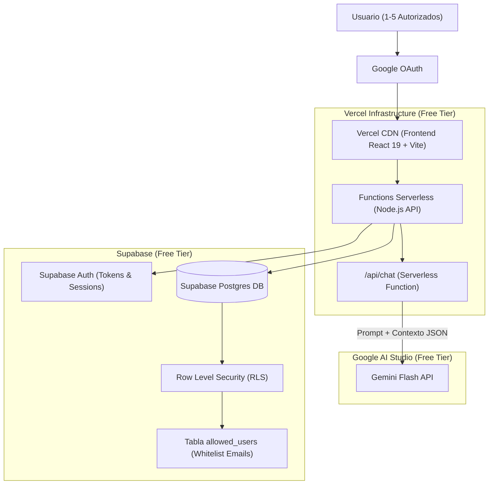
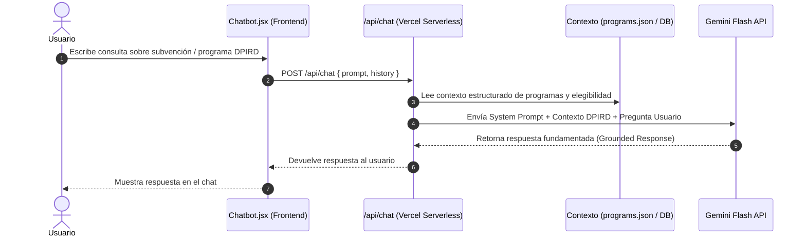

# Arquitectura del Piloto y Hoja de Ruta — DPIRD WA Tool

Este documento define la **Arquitectura Tecnológica del Piloto** ajustada a las necesidades reales del proyecto para la fase inicial (1–5 usuarios, costo $0 de infraestructura, acceso restringido mediante Google OAuth, Row Level Security en Supabase e integración real de IA con Gemini API).

---

## 1. Visión General de la Arquitectura del Piloto

Para la fase de piloto se adopta una arquitectura Serverless / PaaS sin costo de infraestructura, maximizando la velocidad de despliegue, la seguridad y una experiencia interactiva real con IA.



---

## 2. Componentes de la Arquitectura de Piloto

| Capa | Tecnología | Función y Configuración en Piloto |
|---|---|---|
| **Frontend** | React 19 + Vite + Tailwind CSS | Mismo desarrollo SPA existente en `Development/Tool` sin necesidad de reescritura. |
| **Hosting & CDN** | **Vercel** (Free Tier) | Hosting estático con HTTPS forzado, CDN global y despliegue automático desde GitHub. |
| **Backend & Serverless API** | **Vercel Serverless Functions** (Node.js) | Endpoints API para conectar con Supabase y orquestar el Chatbot de IA. |
| **Base de Datos** | **Supabase** (PostgreSQL, Free Tier) | Persistencia relacional para reemplazar Mock Data (`Grants`, `Resources`, usuarios, diagnósticos). |
| **Autenticación** | **Supabase Auth + Google OAuth** | Gestión de identidad mediante Google Login. Cero contraseñas ni tokens JWT a medida. |
| **Seguridad & Acceso** | **Row Level Security (RLS) + Whitelist** | Control de acceso restringido a nivel de DB mediante la tabla `allowed_users`. |
| **Chatbot IA Real** | **Gemini Flash API** (Free Tier) | RAG ligero inyectando contexto estructurado (`programs.json`, `questions.json`) vía Vercel Function. |

---

## 3. Integración del Chatbot con Gemini API (RAG Ligero)

El prototipo evoluciona de un chatbot simulado a un asistente conversacional real impulsado por **Gemini Flash**:



### Aspectos Clave de Gemini Flash en el Piloto:
- **Enfoque RAG Ligero**: No requiere base de datos vectorial (Pinecone/ChromaDB). El contexto de las subvenciones y recursos se inyecta directamente en el *system prompt* de la función serverless.
- **Cuota Free Tier**: 15 RPM / 1.500 peticiones diarias en Gemini Flash (sobrado para 1–5 usuarios). Costo = **$0 USD**.
- **Gestión de API Keys**: Generada en un proyecto dedicado en Google AI Studio y almacenada como variable de entorno `GEMINI_API_KEY` en Vercel (nunca visible en el cliente/Git).
- **Privacidad**: La información tratada (programas DPIRD, fechas, montos) es pública.

---

## 4. Estrategia de Seguridad y Acceso Restringido (Defensa en Profundidad)

1. **Tabla `allowed_users`**: Registro de correos electrónicos autorizados para el piloto.
2. **Políticas RLS en Supabase**: Cualquier petición (incluso directa a la API) de un correo no registrado en `allowed_users` es rechazada a nivel de base de datos (`403 Forbidden`).
3. **Variables de Entorno Estrictas**: `SUPABASE_URL`, `SUPABASE_ANON_KEY`, `GEMINI_API_KEY` en Vercel.

---

## 5. Evolución: Comparativa Piloto vs Producción

| Componente | **Fase Piloto (Actualizada)** | **Fase Producción (Futuro)** |
|---|---|---|
| **Usuarios** | 1–5 usuarios autorizados | Escala masiva (SMEs / Pymes de WA) |
| **Hosting** | Vercel Free Tier | Vercel Enterprise / AWS (CloudFront + S3) |
| **Backend** | Vercel Serverless Functions | NestJS / FastAPI Microservicios |
| **Base de Datos** | Supabase Postgres (Free Tier) | AWS RDS PostgreSQL + Redis Cache |
| **Autenticación** | Supabase Auth + Google OAuth | Enterprise SSO / GovAuth OIDC |
| **Chatbot / IA** | **Gemini Flash (RAG ligero sin Vector DB)** | LLM avanzado + Vector DB (Pinecone/ChromaDB) + RAG completo |
| **Costo Inicial** | **$0 / mes** | Escalable según consumo |

---

## 6. Resumen de Puntos de Integración del Piloto

```text
Vercel (Hosting + Serverless) 
  + Supabase (Postgres + Auth + RLS Whitelist) 
  + Google OAuth 
  + Gemini Flash API (RAG ligero para Chatbot)
```
